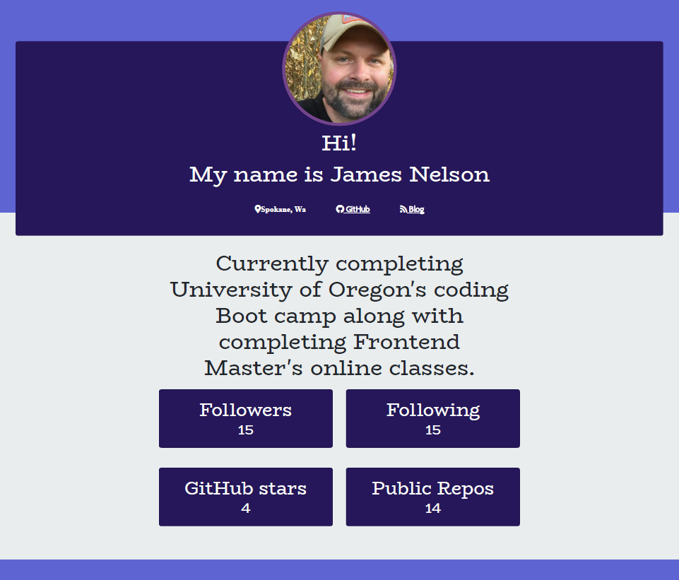

# Node App - Github Developer Profile Generator

2020

### DESCRIPTION

Node app that quickly generates a professional profile in .pdf format. When the app is run, it prompts the user to enter a Github user name and choose a pre-determined color theme. It then generates a .pdf profile made from that Github users information.

### INSTALLATION INSTRUCTIONS

1. Install the required modules by typing "npm install" or "npm i" in the containing folder using your code editor terminal.
2. Run the app by typing "node index.js" or "node index."
3. Enter the Github user name and choose a color them for the profile.
4. The new .pdf profile will be created in that same folder.

### BUILT WITH

- [HTML](https://html.com/)
- [CSS](https://www.w3schools.com/css/)
- [Javascript](https://www.javascript.com/)
- [Bootstrap](https://getbootstrap.com/)
- [Node](https://nodejs.org/en/)
- [NPM](https://www.npmjs.com/)

### NODE MODULES USED

- [Inquirer](https://www.npmjs.com/package/inquirer)
- [Axios](https://www.npmjs.com/package/axios)
- [Electron](https://www.npmjs.com/package/electron)
- [Electron-html-to](https://www.npmjs.com/package/electron-html-to)

### ARTHOR

###### [JAMES](https://github.com/alpinelife37)

MIT License

Copyright (c) [2020][james nelson]

Permission is hereby granted, free of charge, to any person obtaining a copy
of this software and associated documentation files (the "Software"), to deal
in the Software without restriction, including without limitation the rights
to use, copy, modify, merge, publish, distribute, sublicense, and/or sell
copies of the Software, and to permit persons to whom the Software is
furnished to do so, subject to the following conditions:

The above copyright notice and this permission notice shall be included in all
copies or substantial portions of the Software.

THE SOFTWARE IS PROVIDED "AS IS", WITHOUT WARRANTY OF ANY KIND, EXPRESS OR
IMPLIED, INCLUDING BUT NOT LIMITED TO THE WARRANTIES OF MERCHANTABILITY,
FITNESS FOR A PARTICULAR PURPOSE AND NONINFRINGEMENT. IN NO EVENT SHALL THE
AUTHORS OR COPYRIGHT HOLDERS BE LIABLE FOR ANY CLAIM, DAMAGES OR OTHER
LIABILITY, WHETHER IN AN ACTION OF CONTRACT, TORT OR OTHERWISE, ARISING FROM,
OUT OF OR IN CONNECTION WITH THE SOFTWARE OR THE USE OR OTHER DEALINGS IN THE
SOFTWARE.
